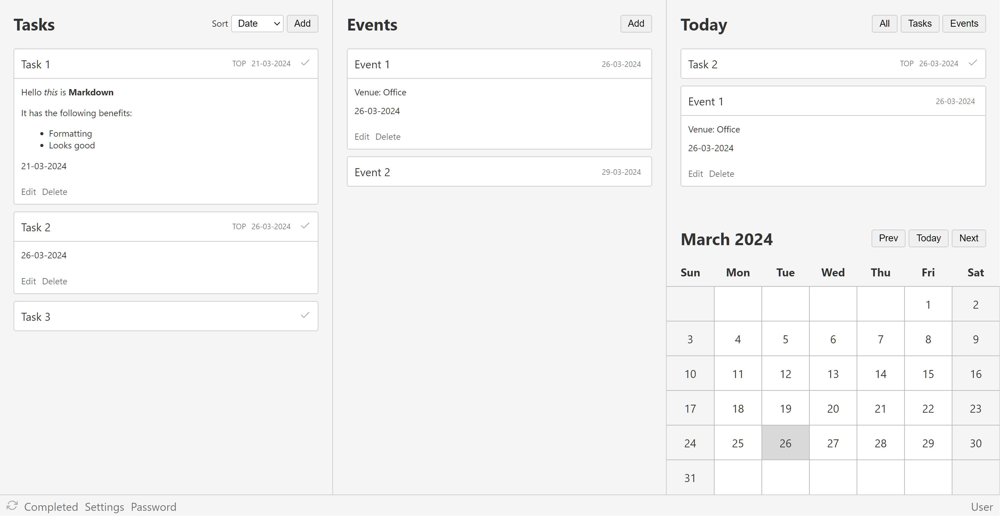

# Tasks and events

This is a personal dashboard for managing tasks and events. It is a very simple app with tasks, events, and calender in one screen. This app was created to serve as a dashboard for work.

## The backend

The api.php is a single file backend which syncs the content in json format to server if the password (i.e. token) in the file matches the password used by the user in the frontend.

If the password does not match, data of the user will be stored only in local storage and will not sync to the server. However, in this scenario too, the app is fully functional.